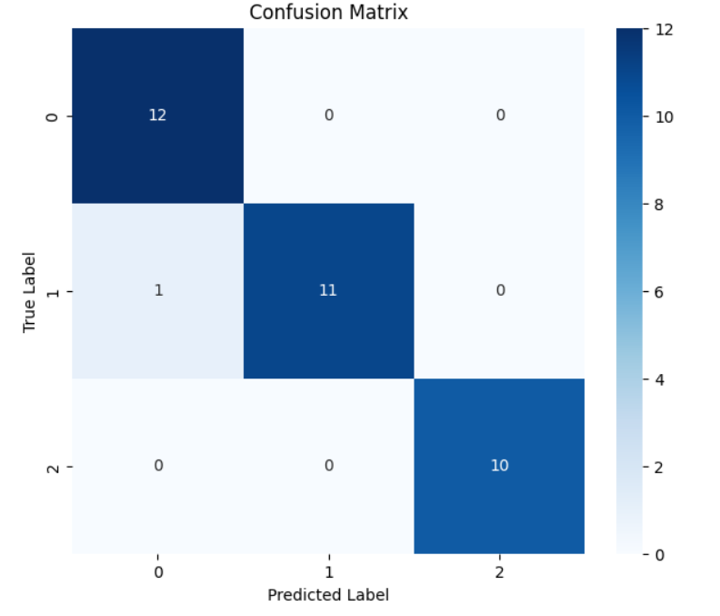
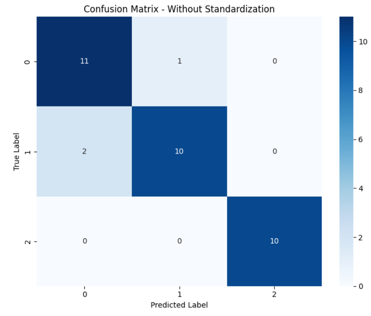

# Horse Gait Recognition Using Skeleton Features

This project focuses on recognizing horse gaits (walk, trot, canter) by analyzing skeleton annotations over time. The goal is to extract features from skeleton data and classify the gaits using machine learning.

## Table of Contents

1. [Project Overview](#project-overview)
2. [Repository Structure](#repository-structure)
3. [How to Use This Project](#how-to-use-this-project)
   - [1. Data Preparation](#1-data-preparation)
   - [2. Feature Extraction](#2-feature-extraction)
   - [3. Model Training & Testing](#3-model-training--testing)
4. [Features](#features) 
  - [16 Feature Model](#16-feature-model) 
  - [18 Feature Model](#18-feature-model)
5. [Results](#results)
6. [Future Work](#future-work)

## Project Overview

This repository is designed to help recognize horse gaits based on skeleton annotations. The project focuses on **feature extraction** from sequences of skeleton data and then **classifying** horse gaits using machine learning.

---

## Repository Structure
<pre>
<code>
├── Scripts/
│   ├── 16FeatureModel.ipynb
│   ├── 18FeatureModel.ipynb
├── Data_gen/
│   └── Multi.ipynb
├── Data/
│   ├── Raw/
│   ├── Extracted/
│   └── Features/
├── Assets/
└── README.md
</code>
</pre>
- **Scripts/**: Contains Jupyter notebooks for classification.
- **Data_gen/**: Preprocessing, data splitting (cross-subject), and sequence extraction.
- **Data/**: Stores raw data, processed sequences, and extracted features.
- **Assets/**: Contains figures (confusion matrices, feature importance plots).

## How to Use This Project

### 1. Data Preparation
Place the raw JSON skeleton annotation files into the `Data/Raw/` folder. Use the data processing script located in `Data_gen/Multi.ipynb`. This extracts annotation sequences from the raw JSON file and splits the data into training and testing sets using a cross-subject split.

### 2. Feature Extraction
Choose between the 16-feature or 18-feature extraction models by using one of the notebooks:
- `Scripts/16FeatureModel.ipynb`
- `Scripts/18FeatureModel.ipynb`

Each notebook will extract features from the skeleton sequences and save them to `Data/Features/`.

### 3. Model Training & Testing
Once the features are extracted, train a Random Forest classifier on the training data and evaluate it on the test set. The trained models and results are saved in the repository.

## Features

This project focuses on two sets of features for horse gait recognition:

### 16 Feature Model

This model extracts the following key gait dynamics:

1. **Vertical Displacement**: 
   - **Definition**: Vertical movement of hoof keypoints.
   - **Calculation**: Measured as the difference in the vertical position of each hoof keypoint across frames. The vertical displacement for each hoof is computed by analyzing the y-coordinates of the keypoints over time and calculating both the maximum and mean values throughout the sequence.

2. **Symmetry**:
   - **Definition**: Comparison of left and right strides.
   - **Calculation**: Evaluated by comparing the duration and displacement of the left and right hooves. A symmetric gait exhibits similar values for both sides, while asymmetry may indicate lameness or other gait abnormalities.

3. **Pattern Regularity**:
   - **Definition**: Consistency of stride patterns over time.
   - **Calculation**: Measured using the coefficient of variation of stride lengths over a defined period. A consistent pattern results in lower variation, while significant fluctuations indicate irregularities in the gait.

4. **Skewness**: 
   - **Definition**: Measure of asymmetry in the distribution of vertical displacements of hoof keypoints.
   - **Calculation**: Computed from the distribution of vertical displacements using the skewness formula, which evaluates how much the distribution deviates from a normal distribution of the y-coordinates. Positive skewness indicates that higher vertical movements are more common, while negative skewness suggests that lower movements are more frequent. 

5. **Kurtosis**:
   - **Definition**: Measure of the "tailedness" of the distribution of vertical displacements of hoof keypoints.
   - **Calculation**: Calculated using the kurtosis formula, which assesses the peak and tails of the vertical displacement distribution. High kurtosis indicates a distribution with heavy tails (more extreme values), while low kurtosis reflects a flatter distribution.

6. **Right-Left Correlation**:
   - **Definition**: Relationship between left and right strides.
   - **Calculation**: This correlation is specifically calculated for the front feet and back feet by analyzing the synchronized timing and movement of the hooves. A high correlation indicates coordinated movement, while low correlation may signal gait issues.

### 18 Feature Model

The 18-feature model builds upon the 16 features by adding:

7. **Stride Length**: 
   - **Definition**: Distance covered in one stride.
   - **Calculation**: Measured as the distance between two successive hoof placements on the x-axis during a single stride, calculated by analyzing the x-coordinates of the hoof keypoints.

8. **Stride Frequency**: 
   - **Definition**: Number of strides taken in a given time period.
   - **Calculation**: Calculated by counting the number of strides within a defined time interval, typically expressed in Hz. This measure provides insights into the speed and rhythm of the horse's movement.

---

## Results

| Model         | Accuracy | Gait Performance Notes                           |
|---------------|----------|--------------------------------------------------|
| 16 Features   | `0.91`   | Good at distinguishing canter; overlap in walk/trot |
| 18 Features   | `0.97`   | Improved separation of trot from walk           |

### Confusion Matrix

The confusion matrix for both models provides insight into classification performance:

### Explanation of Results
- The **16 Feature Model** performs well for distinguishing between canter and walk/trot but struggles with misclassifications between walk and trot due to their overlapping characteristics.
- The **18 Feature Model** enhances performance by incorporating stride length and frequency, leading to better classification of gaits, particularly improving the distinction between trot and walk.

## Future Work
- Improve stride measurement.
- Expand the dataset to include more samples for robust training.

